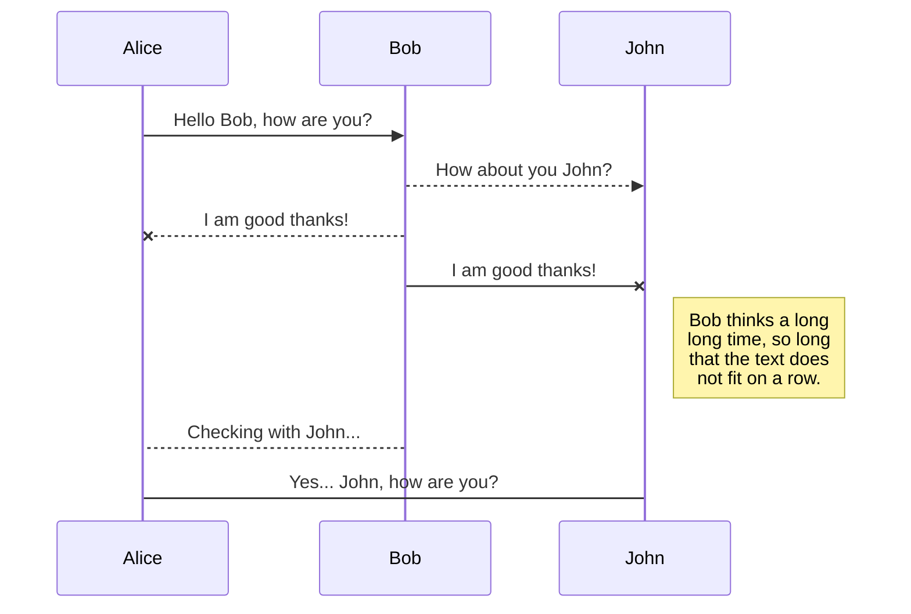
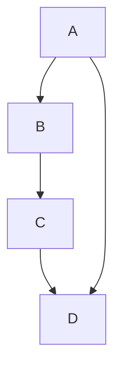

# ideabank
시작 페이지 입니다. 
1. VBA
2. Python
3. Linux
4. HTML+CSS+JS

# Github Testing. 
# Github Desktop 사용 
# Rename ToBeNew

```c
enum tcp_ca_state {
        TCP_CA_Open = 0,
#define TCPF_CA_Open    (1<<TCP_CA_Open)
        TCP_CA_Disorder = 1,
#define TCPF_CA_Disorder (1<<TCP_CA_Disorder)
        TCP_CA_CWR = 2,
#define TCPF_CA_CWR     (1<<TCP_CA_CWR)
        TCP_CA_Recovery = 3,
#define TCPF_CA_Recovery (1<<TCP_CA_Recovery)
        TCP_CA_Loss = 4
#define TCPF_CA_Loss    (1<<TCP_CA_Loss)
};
```




